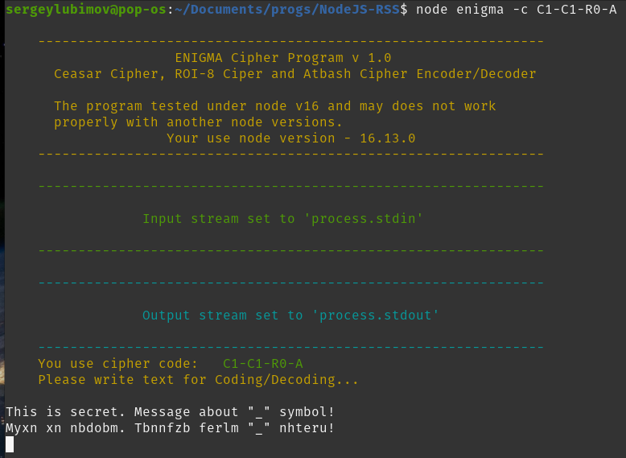
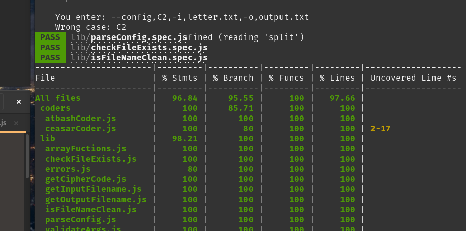

# __Task 2. Testing__

Task [description here](https://github.com/rolling-scopes-school/basic-nodejs-course/blob/master/descriptions/testing.md)

Task due date / deadline date - 21.11.21 / 21.11.21 23:59(GMT+3)

Self check:
 
 TOTAL POINTS - _** 100 points**_
 
-----------
## __Evaluation criteria__

# Testing

## Баллы за реализацию

Evaluation criteria   | Description | URL 
----------------------|-------------|-----
1 | По **плюс 2 балла** за каждый юнит-тест (не более **20 баллов** в сумме, баллы начисляются не более чем за 3 теста на каждую отдельную функцию/компонент). | Для провекри можете выбрать любые файлы тестов из директории https://github.com/SeLub/NodeJS-RSS/blob/task-2/lib/ или https://github.com/SeLub/NodeJS-RSS/blob/task-2/coders/atbashCoder.spec.js
2 | Покрытие не менее 70% **плюс 20 баллов** (покрытие по **строкам**, вычисляется при помощи `jest --coverage`) | смотрите скриншоты 
3 | В тестах задействованы все сценарии из описания **плюс 20 баллов** | Все сценарии и даже больше находятся в этих файлах https://github.com/SeLub/NodeJS-RSS/blob/task-2/lib/validateArgs.spec.js и https://github.com/SeLub/NodeJS-RSS/blob/task-2/lib/parseConfig.spec.js
4 | Для тестирования используются mock-объекты **плюс 20 баллов** | Во многих тестах использовал mock-объекты Здесь, например, помимо прочего мокал 'fs' https://github.com/SeLub/NodeJS-RSS/blob/task-2/streams/readStream.spec.js

## Продвинутая реализация

1. Покрытие не менее 85% **плюс 20 баллов** (покрытие по **бранчам** вычисляется при помощи `jest --coverage`)

Evaluation criteria   | Description | URL 
----------------------|-------------|-----
1 | Покрытие не менее 85% **плюс 20 баллов** (покрытие по **бранчам** вычисляется при помощи `jest --coverage`) | Смотрите скриншоты ниже

## Штрафы 

Evaluation criteria   | Description | Total
----------------------|-------------|-----
1 | Не используется Jest **минус 80 баллов** | Использовал Jest
2 | Имеются коммиты после дедлайна, за исключением коммитов, изменяющих исключительно в `Readme.md` либо вспомогательные файлы (`.gitignore`, `.prettierrc.json` и т.д.) | Коммитов после дедлайна нет
3 | Отсутствует PR либо его описание некорректно (отсутствуют либо некорректен любой из 3 обязательных пунктов) **минус 20 баллов** | PR присутствует и заполнен корректно
4 | Отсутствует отдельная ветка для разработки **минус 20 баллов** | Для разработки используются специальная ветка
5 | Меньше 3 коммитов в ветке разработки, не считая коммиты, вносящие изменения только в `Readme.md` либо вспомогательные файлы (`.gitignore`, `.prettierrc.json` и т.д.) | На момент написания отчёта в проекте 52 коммита

------------

# __Summary Report__

Я уложился в дедлайн и коммиты после него делать не буду.

Оставляю за собой право на коммит по исправлению и дополнению отчёта после дедлайна (так можно!).

__Спасибо за Ваше время и ваш интерес к моей работе!!!__

__ !!!! Для запуска тестов используйте команду: npm run test -- --coverage__

-----

## Screenshots 

------------

#### **Enigma Cipher Program v.2** -  улучшил внешний вид, логику, сделал рефакторинг (в т.ч. и на основе тестов)

#### **Тесты Jest** -  показатели по тестированию

